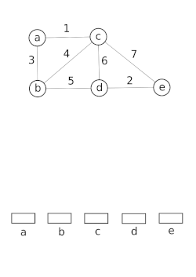

<!-- _class: title  -->

# Najkraći putevi i minimalno razapinjuće stablo (MST)

Programiranje za rješavanje složenih problema

---

# Sadržaj

1. **Uvod i Motivacija**
   - Proširenje problema najkraćeg puta
   - Što je MST?
2. **Najkraći Putevi Svi-Svim**
   - Floyd-Warshall algoritam
3. **Minimalno Razapinjuće Stablo (MST)**
   - Kruskalov algoritam (Union-Find)
   - Primov algoritam
4. **Zadaci za Vježbu**

---

<!-- _class: lead -->

# 1. Uvod i motivacija

## Proširenje problema najkraćeg puta

Do sada smo rješavali *Single-Source Shortest Path* (Dijkstra, Bellman-Ford).
Što ako nam trebaju udaljenosti između **svih parova** čvorova?

**Naivni pristupi:**

- **Dijkstra $n$ puta:**
  - Složenost: $O(n \cdot m \log n)$ (samo nenegativne težine).
- **Bellman-Ford $n$ puta:**
  - Složenost: $O(n^2 \cdot m)$ (radi s negativnim težinama).

Ovi pristupi mogu biti prespori za guste grafove. Danas učimo **Floyd-Warshall** ($O(n^3)$).

---

# Problem minimalnog razapinjućeg stabla (MST) (1/2)


**Prikaz razlike između grafa i MST-a**

Izvor: [Discrete Mathematics - Spanning Trees](https://www.tutorialspoint.com/discrete_mathematics/discrete_mathematics_spanning_trees.htm)

---

# Problem minimalnog razapinjućeg stabla (MST) (2/2)

**Motivacija:** Povezivanje $n$ gradova električnom mrežom uz **minimalan ukupan trošak**.

**Definicija:**

- **Ulaz:** Neusmjeren, težinski graf.
- **Razapinjuće stablo:** Podgraf koji povezuje sve čvorove i nema ciklusa.
- **MST:** Stablo čiji je zbroj težina bridova najmanji moguć.

**Algoritmi koje radimo:**

1. **Kruskalov:** Dodaj najlakši brid koji ne stvara ciklus.
2. **Primov:** Širi stablo od početnog čvora prema najbližim susjedima.

---

# Preporučena literatura

- **CPH (Competitive Programmer's Handbook):**
  - Poglavlje 13.3: *Floyd-Warshall algorithm*
  - Poglavlje 15: *Spanning trees*
- **CLRS (Introduction to Algorithms):**
  - Poglavlje 25: *All-Pairs Shortest Paths*
  - Poglavlje 23: *Minimum Spanning Trees*
  - Poglavlje 21: *Data Structures for Disjoint Sets* (za Union-Find)

---
<!-- _class: lead -->

# 2. Floyd-Warshall algoritam

## Intuicija: Dinamičko programiranje

Najkraći putevi svi sa svim
Ideja: Postupno poboljšavati procjenu udaljenosti između $i$ i $j$ dodavanjem mogućih **međučvorova**.

1. **Stanje:** `dist[i][j]` = duljina najkraćeg puta od $i$ do $j$.
2. **Inicijalizacija:**
    - `0` ako je $i=j$, `težina` ako postoji brid, `∞` inače.
3. **Tranzicija:**
    Iteriramo kroz svaki čvor $k$ (od $1$ do $n$) i provjeravamo možemo li skratiti put od $i$ do $j$ prolaskom kroz $k$.

$$dist[i][j] = \min(dist[i][j], \quad dist[i][k] + dist[k][j])$$

---

# Implementacija (C++)

Jednostavna implementacija s tri ugniježđene `for` petlje.

```cpp
const int INF = 1e9;
int dist[N][N]; // Matrica udaljenosti

// Glavni dio algoritma
for (int k = 1; k <= n; ++k) {         // K: potencijalni međučvor
    for (int i = 1; i <= n; ++i) {     // I: početni čvor
        for (int j = 1; j <= n; ++j) { // J: završni čvor
            
            // Paziti na overflow ako je dist[i][k] == INF
            if (dist[i][k] != INF && dist[k][j] != INF) {
                dist[i][j] = min(dist[i][j], dist[i][k] + dist[k][j]);
            }
        }
    }
}
```

---

# Analiza i primjene

- **Složenost:** $O(n^3)$.
  - Pogodno za $n \le 400$ (približno).
  - Izvrsno za guste grafove ($m \approx n^2$).
- **Negativne težine:**
  - Radi ispravno s negativnim bridovima.
  - Ne radi s negativnim **ciklusima**.
- **Detekcija negativnih ciklusa:**
  - Ako na kraju algoritma vrijedi `dist[i][i] < 0`, postoji negativni ciklus.
- **Tranzitivno zatvaranje:**
  - Može se koristiti za provjeru *postoji li* put (povezanost) umjesto duljine puta.

---

# 3. Minimalno Razapinjuće Stablo (MST) (1/3)

## Kruskalov algoritam


**Vizualizacija Krsukalova algoritma**
Izvor: [Kruskal's algorithm](https://en.wikipedia.org/wiki/Kruskal%27s_algorithm)

---

<!-- _class: lead -->

# 3. Minimalno Razapinjuće Stablo (MST) (2/3)

## Problem 1: Kruskalov algoritam

**Pohlepna strategija:**
> "Na svakom koraku, dodaj najlakši brid u grafu koji ne stvara ciklus."

**Postupak:**

1. Sortiraj sve bridove po težini (uzlazno).
2. Iteriraj kroz bridove $(u, v)$:
   - Ako su $u$ i $v$ već u istoj komponenti: preskoči (stvorio bi se ciklus).
   - Inače: dodaj brid u MST i spoji komponente.
3. Ponavljaj dok ne spojimo sve čvorove.

---

# 3. Minimalno Razapinjuće Stablo (MST) (3/3)

## Union-Find struktura (DSU)

Za efikasno izvršavanje Kruskalovog algoritma, moramo brzo provjeriti jesu li čvorovi povezani.

- **`find(i)`**: Vraća "šefa" (predstavnika) komponente kojoj $i$ pripada.
- **`unite(i, j)`**: Spaja komponente od $i$ i $j$.

**Optimizacije:**

- *Path Compression* (spljoštavanje stabla pri traženju).
- *Union by Rank/Size* (spajanje manjeg stabla pod veće).
- **Složenost:** Gotovo konstantna, $O(\alpha(n))$ amortizirano.

---

# Implementacija Kruskalovog algoritma

```cpp
struct Edge { int u, v, weight; };
bool compareEdges(const Edge& a, const Edge& b) { return a.weight < b.weight; }

// ... DSU funkcije find_set i unite_sets ...

sort(edges.begin(), edges.end(), compareEdges);

long long total_weight = 0;
for (Edge e : edges) {
    if (find_set(e.u) != find_set(e.v)) { // Ako nisu u istoj komponenti
        total_weight += e.weight;
        unite_sets(e.u, e.v);             // Spoji ih
    }
}
```

**Složenost:** $O(m \log m)$ (zbog sortiranja).

---

# Problem 2: Primov algoritam (1/2)

**Pohlepna strategija:**
> "Gradi stablo počevši od jednog čvora, šireći se na najbliže susjede."

**Sličnost s Dijkstrom:**

- Koristi **Priority Queue**.
- Razlika: Kod Dijkstre je ključ *ukupna udaljenost od starta*, kod Prima je ključ *težina brida* kojim se spajamo na postojeće stablo.

**Algoritam:**

1. Stavi proizvoljni čvor u PQ s cijenom 0.
2. Dok PQ nije prazan: uzmi najjeftiniji čvor $u$.
3. Ako $u$ nije posjećen: označi ga, dodaj cijenu u sumu, i dodaj sve njegove susjede u PQ.

---

# Problem 2: Primov algoritam (2/2)


**Vizualizacija Primovog algoritam:**
Izvor: [Prim's algorithm](https://en.wikipedia.org/wiki/Prim%27s_algorithm)

---

# Implementacija: Primov algoritam

```cpp
priority_queue<pair<long long, int>> q; // {-težina, čvor}
vector<bool> visited(n + 1, false);

q.push({0, 1}); // Počni od čvora 1
long long total_weight = 0;

while (!q.empty()) {
    int u = q.top().second;
    long long w = -q.top().first;
    q.pop();

    if (visited[u]) continue;
    visited[u] = true;
    total_weight += w;

    for (auto edge : adj[u]) {
        if (!visited[edge.first]) {
            q.push({-edge.second, edge.first});
        }
    }
}
```

---

<!-- _class: lead -->

# 4. Zadaci za vježbu

## CSES Problem Set

- **[Road Reparation](https://cses.fi/problemset/task/1675)**
  - Klasičan MST (Prim ili Kruskal).
- **[Road Construction](https://cses.fi/problemset/task/1676)**
  - Praćenje veličine komponenata (Union-Find).
- **[Flight Routes Check](https://cses.fi/problemset/task/1682)**
  - Jaka povezanost.

---

<!-- _class: title -->

# Road Reparation (CSES)

## Analiza i rješenje problema

---

# Analiza zadataka: Road Reparation (1/2)

## Definiranje problema: Road Reparation

Imamo $n$ gradova i $m$ cesta, svaka ima cijenu popravka.
Cilj je odabrati skup cesta tako da su **svi gradovi povezani**, a ukupna cijena popravka bude **minimalna**.

### Intuicija: Road Reparation

1. Moramo povezati $n$ čvorova.
2. Najefikasniji način povezivanja $n$ čvorova bez suvišnih bridova je **stablo** ($n-1$ bridova).
3. Tražimo stablo s najmanjom sumom težina.

**Zaključak:** Ovo je klasiča primjer **MST (Minimalno Razapinjuće Stablo)** problema.

---

# Analiza zadataka: Road Reparation (2/2)


**Odbacivanje brida**
Izvor: [Kruskal’s Algorithm: Key to Minimum Spanning Tree [MST]](https://www.simplilearn.com/tutorials/data-structure-tutorial/kruskal-algorithm)

---

# Strategija rješavanja: Kruskalov algoritam

Za ovaj problem Kruskalov algoritam je vrlo intuitivan:

1. **Sortiraj** sve ceste po cijeni (od najmanje do najveće).
2. **Pohlepni pristup:** Uzimaj ceste redom.
3. Ako cesta povezuje dva grada koji **već jesu povezani** (direktno ili indirektno), odbaci je (jer stvara ciklus i nepotreban trošak).
4. Ako cesta povezuje dva nepovezana skupa gradova, **kupi je** i spoji skupove.

## Struktura podataka

Za efikasnu provjeru jesu li gradovi već povezani koristimo **Union-Find (DSU)**.

---

# Rubni slučajevi i zamke

## 1. Nemoguće rješenje ("IMPOSSIBLE")

Što ako je graf nepovezan (npr. otok do kojeg ne vodi ni jedna cesta)?

- Ako nakon prolaska kroz sve ceste broj odabranih bridova nije $n-1$, rješenje ne postoji.
- Alternativno: Provjeri je li veličina glavne komponente u DSU jednaka $n$.

### 2. Veliki brojevi

- Cijena ceste $c$ može biti do $10^9$.
- Ukupna cijena može biti $10^5 \times 10^9 = 10^{14}$.
- **Obavezno** koristi `long long` za sumu cijena.

---

# Implementacija: Strukture

```cpp
#include <iostream>
#include <vector>
#include <algorithm>

using namespace std;

struct Edge {
    int u, v, weight;
    // Sortiranje po težini
    bool operator<(const Edge& other) const {
        return weight < other.weight;
    }
};
```

---

# Primjena Union-Find (DSU) (1/2)

## Intuicija iza Union-Find (DSU)


Izvor: [Disjoint-set data structure](https://en.wikipedia.org/wiki/Disjoint-set_data_structure)

---

# Primjena Union-Find (DSU) (2/2)

## "Tko je ovdje šef?"

Zamisli da je na početku svaki grad (čvor) zasebna "ekipa" i sam je svoj šef.

Cilj nam je efikasno pratiti tko pripada kojoj ekipi dok spajamo gradove cestama.

**Struktura podržava dvije brze operacije:**

1. **`Find` (Pronađi):** Tko je glavni predstavnik ("šef") tvoje ekipe?
2. **`Union` (Unija):** Spoji dvije ekipe u jednu (šef jedne ekipe postaje podređen šefu druge).

---

# Kako Union-Find rješava MST?

Kruskalov algoritam nam daje najjeftiniju cestu između grada $U$ i $V$. Moramo odlučiti hoćemo li je graditi.

**Logika:**

1. Pitamo: `Find(U)` i `Find(V)`. (Tko su im šefovi?)
2. **Slučaj A:** Imaju istog šefa.
   - To znači da su $U$ i $V$ već povezani nekim prijašnjim putem.
   - Dodavanje ove ceste stvorilo bi **ciklus** (krug).
   - **Odluka:** Odbacujemo cestu (nepotreban trošak).
3. **Slučaj B:** Imaju različite šefove.
   - Nisu povezani. Ovo je najjeftiniji način da ih spojimo.
   - **Odluka:** `Union(U, V)` (gradimo cestu i spajamo komponente).

---

# Zašto baš Union-Find?

Mogli bismo koristiti BFS ili DFS da provjerimo postoji li put od $U$ do $V$, ali...

- **BFS/DFS:** Postaje spor. Za svaku cestu moramo prolaziti kroz graf. Složenost bi bila $O(M \cdot N)$.
- **Union-Find:** Brz.
  - Uz optimizaciju ("Path Compression"), operacije su gotovo trenutačne ($O(1)$ amortizirano).
  - Ukupna složenost Kruskalovog algoritma postaje određena sortiranjem: $O(M \log M)$.

---

# Vizualizacija procesa

```text
Početak: (1)   (2)   (3)   (4)  -> Svako je svoj šef.

Korak 1: Spoji 1-2
(1-2)   (3)   (4)           -> 1 je šef za 2.

Korak 2: Spoji 3-4
(1-2)   (3-4)               -> 3 je šef za 4.

Korak 3: Pokušaj spojiti 1-4
Find(1) -> 1
Find(4) -> 3
Različiti su! Spoji (Unija 1 i 3).
(1-2-3-4)                   -> Svi su povezani.
```

---

```cpp
// Union-Find (DSU) struktura
vector<int> parent, sz;

int find_set(int v) {
    if (v == parent[v]) return v;
    return parent[v] = find_set(parent[v]);
}

void unite_sets(int a, int b) {
    a = find_set(a);
    b = find_set(b);
    if (a != b) {
        if (sz[a] < sz[b]) swap(a, b);
        parent[b] = a;
        sz[a] += sz[b];
    }
}
```

---

# Implementacija: Glavni dio (1/2)

```cpp
int main() {
    int n, m;
    cin >> n >> m;

    vector<Edge> edges(m);
    for (int i = 0; i < m; i++) {
        cin >> edges[i].u >> edges[i].v >> edges[i].weight;
    }

    // 1. Sortiranje bridova
    sort(edges.begin(), edges.end());

    // 2. Inicijalizacija DSU
    parent.resize(n + 1);
    sz.resize(n + 1, 1);
    for (int i = 1; i <= n; i++) parent[i] = i;

    // ... nastavak na idućem slajdu
```

---

# Implementacija: Glavni dio (2/2)

```cpp
    long long total_cost = 0;
    int edges_count = 0;

    // 3. Kruskalov algoritam
    for (const auto& edge : edges) {
        if (find_set(edge.u) != find_set(edge.v)) {
            unite_sets(edge.u, edge.v);
            total_cost += edge.weight;
            edges_count++;
        }
    }

    // 4. Provjera rješenja
    // MST mora imati točno n-1 bridova da bi povezao n čvorova
    if (edges_count == n - 1) {
        cout << total_cost << endl;
    } else {
        // Poseban slučaj: n=1 traži 0 bridova, 
        // ali za n > 1 ako nemamo n-1 bridova, graf je nepovezan.
        if (n == 1) cout << 0 << endl; 
        else cout << "IMPOSSIBLE" << endl;
    }

    return 0;
}
```

---

# Sažetak rješenja (Road Reparation)

1. **Prepoznaj MST:** Ključne riječi "connect all cities", "minimum cost".
2. **Kruskal:** Sortiraj bridove + Union-Find.
3. **Pazi na tipove:** `long long` za cijenu.
4. **Pazi na nepovezanost:** Provjeri jesu li spojeni svi čvorovi (broj bridova ili veličina komponente).

---

<!-- _class: title -->

# Road Construction (CSES)

## Praćenje komponenata u stvarnom vremenu

---

# Analiza zadatka: Road Construction (2/2)

## Definiranje problema: Road Construction

Imamo $n$ gradova i **nema cesta**. Svaki dan gradi se jedna nova cesta (ukupno $m$ dana).
Nakon gradnje **svake** ceste moramo ispisati:

1. **Broj komponenata:** Koliko ima odvojenih grupa gradova?
2. **Veličinu najveće komponente:** Koliko gradova ima u najvećoj povezanoj grupi?

### Zašto je ovo drugačije od prethodnog?

U "Road Reparation" (MST) nas je zanimalo konačno stanje.
Ovdje nas zanima **stanje nakon svake promjene**. Ovo je problem **dinamičke povezanosti** (samo dodavanje bridova).

---

# Intuicija i praćenje stanja

Počinjemo s $N$ izoliranih gradova.

- **Broj komponenata:** $N$
- **Najveća komponenta:** 1 (svatko je sam)

Kada dodamo cestu između grada $A$ i grada $B$:

1. Provjerimo jesu li već povezani (`find(A) == find(B)`).
   - Ako **JESU**: Ništa se ne mijenja. Broj komponenata i veličine ostaju isti.
2. Ako **NISU**:
   - Spajamo ih (`unite`). Dvije grupe postaju jedna.
   - **Broj komponenata:** Smanjuje se za 1.
   - **Veličina:** Nova veličina je `size[A] + size[B]`. Provjerimo je li to novi rekord.

---

# Prilagodba Union-Find (DSU) strukture

Standardni DSU treba malo proširiti. Osim `parent` niza, treba nam:

1. **`size[]` niz:** `size[i]` pamti koliko čvorova ima u podstablu čiji je korijen `i`. Inicijalno je `1` za sve.
2. **`num_components` varijabla:** Inicijalno $N$. Smanjujemo je kad god uspješno spojimo dva različita skupa.
3. **`max_component_size` varijabla:** Inicijalno 1. Ažuriramo je pri spajanju.

---

# Implementacija: varijable i inicijalizacija (1/2)

## Varijable

```cpp
#include <iostream>
#include <vector>
#include <algorithm>

using namespace std;

// Globalne varijable za DSU i praćenje stanja
vector<int> parent, sz;
int num_components;
int max_component_size = 1;
```

---

# Implementacija: varijable i inicijalizacija (2/2)

## Inicijalizacija

```cpp
// Inicijalizacija
void init_dsu(int n) {
    num_components = n;
    max_component_size = 1;
    parent.resize(n + 1);
    sz.resize(n + 1, 1); // Svaka komponenta je veličine 1
    for (int i = 1; i <= n; i++) parent[i] = i;
}

int find_set(int v) {
    if (v == parent[v]) return v;
    return parent[v] = find_set(parent[v]);
}
```

---

# Implementacija: logika spajanja (unite)

Ovo je glavni dio rješenja. Ovdje ažuriramo tražene vrijednosti.

```cpp
void unite_sets(int a, int b) {
    a = find_set(a);
    b = find_set(b);

    if (a != b) {
        // Union by size optimizacija: manje stablo ide pod veće
        if (sz[a] < sz[b]) swap(a, b);
        
        parent[b] = a;       // Spajamo b pod a
        sz[a] += sz[b];      // Ažuriramo veličinu korijena a
        
        // Ažuriranje globalnih brojaca
        num_components--;    // Jedna komponenta manje
        max_component_size = max(max_component_size, sz[a]);
    }
}
```

---

# Implementacija: glavni program

```cpp
int main() {
    ios_base::sync_with_stdio(false); // Brzi I/O
    cin.tie(NULL);

    int n, m;
    cin >> n >> m;

    init_dsu(n);

    for (int i = 0; i < m; i++) {
        int u, v;
        cin >> u >> v;
        
        // Pokušamo spojiti i odmah ažuriramo stanja
        unite_sets(u, v);

        // Nakon svake ceste ispisujemo trenutacno stanje
        cout << num_components << " " << max_component_size << "\n";
    }

    return 0;
}
```

---

# Sažetak

1. **Prepoznavanje:** Zadatak traži praćenje povezanosti i veličine skupova *nakon svakog dodavanja*.
2. **Alat:** Union-Find (DSU) s praćenjem veličine (`size` array).
3. **Logika:**
   - Spajanje različitih skupova $\rightarrow$ `komponente--`.
   - Veličina nove grupe $\rightarrow$ `size[rootA] += size[rootB]`.
4. **Složenost:** $O(M \cdot \alpha(N))$, što je praktički linearno. Vrlo efikasno.

---

<!-- _class: title -->

# Flight Routes Check (CSES)

## Jaka povezanost u usmjerenim grafovima

---

# Analiza Zadatka: Flight Routes Check

## Opis problema: Flight Routes Check

Imamo $n$ gradova i $m$ **jednosmjernih** letova.
Moramo provjeriti možemo li od **bilo kojeg** grada doći do **bilo kojeg drugog** grada.

### Ključna razlika

U neusmjerenim grafovima (kao "Road Reparation"), dovoljno je pokrenuti DFS/BFS iz jednog čvora i vidjeti jesmo li posjetili sve.
U **usmjerenim** grafovima to nije dovoljno!

- Možda možemo doći iz $1 \to 2$, ali ne možemo iz $2 \to 1$.
- Ovo svojstvo zove se **Jaka Povezanost (Strong Connectivity)**.

---

# Strategija: Ideja "Huba"

Umjesto da provjeravamo sve parove (presporo $O(N^2)$), odaberimo proizvoljan čvor, npr. **Grad 1**.

Graf je jako povezan ako i samo ako vrijede dva uvjeta:

1. **Iz Grada 1 možemo doći do svih ostalih gradova.**
2. **Iz svih ostalih gradova možemo doći do Grada 1.**

Ako vrijedi oboje, onda put $A \to B$ izgleda ovako: $A \to \dots \to 1 \to \dots \to B$.

---

# Algoritam: Dva prolaza (Forward & Backward) (1/2)


**Transponirani graf**
Izvor: [Transpose graph](https://en.wikipedia.org/wiki/Transpose_graph)

---

# Algoritam: Dva prolaza (Forward & Backward) (2/2)

Kako efikasno provjeriti uvjete?

1. **Forward Pass:** Pokreni DFS iz Grada 1 na **originalnom grafu**.
   - Ako neki čvor $X$ nije posjećen $\rightarrow$ Ne možemo doći $1 \to X$.
   - **Rješenje:** NO, $1 \space X$.

2. **Backward Pass:** Pokreni DFS iz Grada 1 na **obrnutom (transponiranom) grafu**.
   - Obrnuti graf ima sve bridove usmjerene suprotno ($A \to B$ postaje $B \to A$).
   - Ako u obrnutom grafu dođemo od $1$ do $Y$, to znači da u originalnom postoji put $Y \to 1$.
   - Ako neki čvor $Y$ nije posjećen $\rightarrow$ Ne možemo doći $Y \to 1$.
   - **Rješenje:** NO, $Y \space 1$.

---

# Implementacija: Priprema

Trebaju nam dvije liste susjedstva: jedna za pravi smjer, jedna za obrnuti.

```cpp
#include <iostream>
#include <vector>

using namespace std;

const int MAXN = 100005;
vector<int> adj[MAXN];      // Originalni graf
vector<int> adj_rev[MAXN];  // Obrnuti graf
bool visited[MAXN];
int n;

void dfs(int u, vector<int> graph[]) {
    visited[u] = true;
    for (int v : graph[u]) {
        if (!visited[v]) dfs(v, graph);
    }
}
```

---

# Implementacija: Glavna logika

```cpp
int main() {
    int m;
    cin >> n >> m;
    for (int i = 0; i < m; i++) {
        int u, v; cin >> u >> v;
        adj[u].push_back(v);      // Brid u pravom smjeru
        adj_rev[v].push_back(u);  // Brid u obrnutom smjeru
    }

    // 1. FORWARD PASS (Provjera 1 -> Svi)
    dfs(1, adj);
    for (int i = 1; i <= n; i++) {
        if (!visited[i]) {
            cout << "NO\n1 " << i << endl; // Nismo mogli doći do i
            return 0;
        }
    }
    // ... nastavlja se
```

---

# Implementacija: Drugi prolaz

```cpp
    // Resetiramo visited niz
    for (int i = 1; i <= n; i++) visited[i] = false;

    // 2. BACKWARD PASS (Provjera Svi -> 1)
    // DFS na obrnutom grafu iz 1 simulira traženje tko sve može doći do 1
    dfs(1, adj_rev);

    for (int i = 1; i <= n; i++) {
        if (!visited[i]) {
            cout << "NO\n" << i << " 1" << endl; // i ne može doći do 1
            return 0;
        }
    }

    cout << "YES" << endl;
    return 0;
}
```

---

# Sažetak rješenja: Flight Routes Check

1. **Jaka povezanost:** U usmjerenom grafu svatko mora moći do svakoga.
2. **Trik s obrnutim grafom:**
   - Provjeri $1 \to \text{svi}$ (običan DFS).
   - Provjeri $\text{svi} \to 1$ (DFS na grafu s obrnutim bridovima).
3. **Kontraprimjer:** Prvi neposjećeni čvor u bilo kojem prolazu daje nam odgovor "NO" i par gradova koji nisu povezani.
4. **Složenost:** $O(N + M)$ – dva linearna prolaza.

---

<!-- _class: title -->

# Sažetak i zaključak

## Što smo danas naučili?

---

# Pregled algoritama

## 1. Floyd-Warshall

- **Što radi:** Najkraći putevi između *svih* parova čvorova.
- **Kada koristiti:** Mali grafovi ($N \le 400$), gusti grafovi, negativne težine (bez ciklusa).
- **Složenost:** $O(N^3)$.

## 2. MST (Minimalno Razapinjuće Stablo)

- **Što radi:** Povezuje sve čvorove uz minimalnu cijenu.
- **Algoritmi:**
  - **Kruskal:** Sortiraj bridove + Union-Find.
  - **Prim:** Priority Queue (slično Dijkstri).
- **Složenost:** $O(M \log M)$ ili $O(M \log N)$.

---

# Union-Find (DSU)

Naučili smo da je **DSU** (Disjoint Set Union) ključan alat za mnoge probleme s grafovima, ne samo za MST.

**Primjene:**

1. **Kruskalov algoritam:** Detekcija ciklusa pri gradnji stabla.
2. **Praćenje komponenata:** Brojanje otoka, veličine grupa u stvarnom vremenu ("Road Construction").
3. **Dinamička povezanost:** Brzo odgovaranje na upit "jesu li A i B povezani?".

---

# Ključne napomene

Prilikom rješavanja zadataka, obratite pažnju na sljedeće:

1. **Ograničenja ($N$):**
   - $N \le 400 \rightarrow$ Vjerojatno **Floyd-Warshall**.
   - $N \le 10^5 \rightarrow$ Vjerojatno **BFS/DFS, Dijkstra, Kruskal**.
2. **Tipovi podataka:** Suma težina u MST-u često prelazi `int`. Koristite **`long long`**!
3. **Vrsta grafa:**
   - **Neusmjeren:** Povezanost se lako provjerava BFS-om ili DSU-om.
   - **Usmjeren:** Za jaku povezanost trebate **2x DFS** (pravi i obrnuti graf).

---

# 4. Zadaci za samostalnu vježbu

## Codeforces

Do sada bi trebali moći riješiti većinu zadataka sa tagom `graphs` ili `dfs and similar` ili `shortest paths` do težine `1200`.

- **[DZY Loves Bridges](https://codeforces.com/problemset/problem/445/B)** (Problem 445B): Brojanje povezanih komponenata i primjena Kruskalovog principa za spajanje uz minimalan trošak.
- **[Edgy Trees](https://codeforces.com/problemset/problem/1139/C)** (Problem 1131C): Ne radi se direktno o MST-u, ali ideja spajanja komponenata i brojanja je slična.
