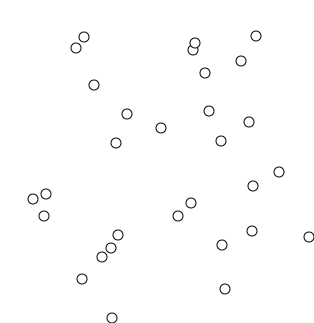
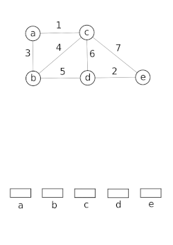
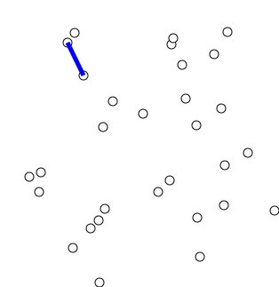

<!-- _paginate: false -->
<!-- _class: title  -->
# Minimalno razapinjuće stablo (MST)

Programiranje za rješavanje složenih problema

---

# Problem minimalnog razapinjućeg stabla (MST) (1/2)


**Prikaz razlike između grafa i MST-a**

Izvor: [Discrete Mathematics - Spanning Trees](https://www.tutorialspoint.com/discrete_mathematics/discrete_mathematics_spanning_trees.htm)

---

# Problem minimalnog razapinjućeg stabla (MST) (2/2)

**Motivacija:** povezivanje $n$ gradova uz **minimalan ukupan trošak**.

**Definicija:**

- **Ulaz:** neusmjeren, težinski graf.
- **Razapinjuće stablo:** podgraf koji povezuje sve čvorove i nema ciklusa.
- **MST:** razapinjuće stablo čiji je zbroj težina bridova najmanji moguć.

**Algoritmi koje radimo:**

1. **Kruskalov:** dodajemo najlakši brid koji ne stvara ciklus.
2. **Primov:** širimo stablo od početnog čvora prema najbližim susjedima.

---

# Preporučena literatura

- **Competitive Programmer's Handbook (CPH):**
  - Poglavlje 15: *Spanning trees*
- **CLRS (Introduction to Algorithms):**
  - Poglavlje 23: *Minimum Spanning Trees*
  - Poglavlje 21: *Data Structures for Disjoint Sets*

---

<!-- _class: lead -->

# Minimalno razapinjuće stablo (MST) (1/4)

## Kruskalov algoritam

**Pohlepna strategija:**
> "Na svakom koraku dodajemo najlakši brid u grafu koji ne stvara ciklus."

**Postupak:**

1. Sortiramo sve bridove po težini (uzlazno).
2. Iteriramo kroz bridove $(u, v)$:
   - Ako su $u$ i $v$ već u istoj komponenti: preskačemo (stvorio bi se ciklus).
   - Inače: dodajemo brid u MST i spajamo komponente.
3. Ponavljamo dok ne spojimo sve čvorove.

---

# Minimalno razapinjuće stablo (MST) (2/4)

**Kruskalov algoritam**


**Vizualizacija Kruskalova algoritma**
Izvor: [Kruskal's algorithm](https://en.wikipedia.org/wiki/Kruskal%27s_algorithm)

---

# Minimalno razapinjuće stablo (MST) (3/4)

**Izazov implementacije: detekcija ciklusa**

Lako je reći "ako ne stvara ciklus", ali kako to efikasno provjeriti u kodu?

**Opcija A: BFS/DFS pretraga**

- Prije dodavanja brida $(u, v)$ pokrenemo BFS da vidimo postoji li već put od $u$ do $v$.
- **Problem:** presporo! Za svaki brid moramo prolaziti graf. Složenost bi bila $O(M \cdot N)$.

**Opcija B: praćenje skupova (DSU)**

- Pamtimo "skupove" povezanih čvorova.
- Ako su $u$ i $v$ u istom skupu $\rightarrow$ imamo ciklus.
- Ovo je praktički **trenutna** provjera. Zato koristimo **Union-Find**.

---

# Minimalno razapinjuće stablo (MST) (4/4)

**Rješenje: Union-Find (DSU) struktura**

Da bi Kruskal bio brz, koristimo strukturu koja podržava dvije operacije:

1. **`Find` (pronađi):** Tko je "šef" komponente kojoj čvor pripada?
   - *Služi za provjeru:* `find(u) == find(v)` znači da su već povezani.
2. **`Union` (unija):** Spajanje dviju komponenata u jednu.
   - *Služi za gradnju:* kad dodamo brid, spajamo skupove.

---

# Union-Find: intuicija (1/2)

**Vizualizacija spajanja**


Izvor: [Disjoint-set data structure](https://en.wikipedia.org/wiki/Disjoint-set_data_structure)

---

# Union-Find: intuicija (2/2)

**"Tko je ovdje šef?"**

Zamislite da je na početku svaki grad (čvor) zasebna "ekipa" i sam je svoj šef.

- Kada spajamo dva grada, jedan šef postaje podređen drugome.
- Svi gradovi u jednoj komponenti imaju **istog glavnog šefa** (predstavnika).

**Optimizacije koje strukturu čine brzom ($O(\alpha(n))$):**

1. **Path compression:** svi zaposlenici direktno pamte glavnog šefa.
2. **Union by size:** manja ekipa se uvijek pripaja većoj.

---

# Implementacija Kruskalovog algoritma

```cpp
struct Edge { int u, v, weight; };
bool usporediBridove(const Edge& a, const Edge& b) { return a.weight < b.weight; }

// ... DSU funkcije find_set i unite_sets ...

sort(edges.begin(), edges.end(), usporediBridove);

long long total_weight = 0;
for (Edge e : edges) {
    if (find_set(e.u) != find_set(e.v)) { // Ako nisu u istoj komponenti
        total_weight += e.weight;
        unite_sets(e.u, e.v);             // Spajamo ih
    }
}
```

**Složenost:** $O(m \log m)$ (zbog sortiranja).

---

# Primov algoritam (1/2)

**Pohlepna strategija:**
> "Gradimo stablo počevši od jednog čvora, šireći se na najbliže susjede."

**Sličnost s Dijkstrom:**

- Koristi **priority queue**.
- Razlika: kod Dijkstre je ključ *ukupna udaljenost od starta*, a kod Prima *težina brida* kojim se spajamo na postojeće stablo.

**Algoritam:**

1. Proizvoljni čvor stavimo u PQ s cijenom 0.
2. Dok PQ nije prazan: uzmemo najjeftiniji čvor $u$.
3. Ako $u$ nije posjećen: označimo ga, dodamo cijenu u sumu i dodamo sve njegove susjede u PQ.

---

# Primov algoritam (2/2)


**Vizualizacija Primovog algoritma**
Izvor: [Prim's algorithm](https://en.wikipedia.org/wiki/Prim%27s_algorithm)

---

# Implementacija: Primov algoritam

```cpp
priority_queue<pair<long long, int>> q; // {-težina, čvor}
vector<bool> visited(n + 1, false);

q.push({0, 1}); // Počinjemo od čvora 1
long long total_weight = 0;

while (!q.empty()) {
    long long w = -q.top().first; // Vraćamo iz minusa u plus
    int u = q.top().second;
    q.pop();

    if (visited[u]) continue;
    visited[u] = true;
    total_weight += w;

    for (auto [v, cost] : adj[u]) {   // adj[u] sadrži parove {susjed, težina}
        if (!visited[v]) {
            q.push({-cost, v});       // Težinu dodajemo kao negativnu vrijednost
        }
    }
}
```

**Složenost:** $O(M \log N)$, kao i Dijkstra.

---

<!-- _class: lead -->

# Zadaci za vježbu

## CSES Problem Set

- **[Road Reparation](https://cses.fi/problemset/task/1675)**
  - Klasičan MST (Prim ili Kruskal).
- **[Road Construction](https://cses.fi/problemset/task/1676)**
  - Praćenje veličine komponenata (Union-Find).

---

<!-- _class: title -->

# Road Reparation (CSES)

## Analiza i rješenje problema

---

# Analiza zadatka: Road Reparation (1/2)

**Definiranje problema**

Imamo $n$ gradova i $m$ cesta, svaka ima cijenu popravka.
Cilj je odabrati skup cesta tako da su **svi gradovi povezani**, a ukupna cijena popravka **minimalna**.

**Intuicija**

1. Moramo povezati $n$ čvorova.
2. Najefikasniji način povezivanja $n$ čvorova bez suvišnih bridova je **stablo** ($n-1$ bridova).
3. Tražimo stablo s najmanjom sumom težina.

**Zaključak:** ovo je klasičan primjer **MST** problema.

---

# Analiza zadatka: Road Reparation (2/2)


**Odbacivanje brida**
Izvor: [Kruskal’s Algorithm: Key to Minimum Spanning Tree [MST]](https://www.simplilearn.com/tutorials/data-structure-tutorial/kruskal-algorithm)

---

# Strategija rješavanja: Kruskalov algoritam

Za ovaj problem Kruskalov algoritam je vrlo intuitivan:

1. **Sortiramo** sve ceste po cijeni (od najmanje do najveće).
2. **Pohlepni pristup:** uzimamo ceste redom.
3. Ako cesta povezuje dva grada koji **već jesu povezani** (direktno ili indirektno), odbacujemo je (stvara ciklus i nepotreban trošak).
4. Ako cesta povezuje dva nepovezana skupa gradova, **kupujemo je** i spajamo skupove.

**Struktura podataka**

Za efikasnu provjeru jesu li gradovi već povezani koristimo **Union-Find (DSU)**.

---

# Rubni slučajevi i zamke

**1. Nemoguće rješenje (ispis `IMPOSSIBLE`)**

Što ako je graf nepovezan (npr. otok do kojeg ne vodi nijedna cesta)?

- Ako nakon prolaska kroz sve ceste broj odabranih bridova nije $n-1$, rješenje ne postoji.
- Alternativno: provjerimo je li veličina glavne komponente u DSU-u jednaka $n$.

**2. Veliki brojevi**

- Cijena ceste $c$ može biti do $10^9$.
- Ukupna cijena može biti $10^5 \times 10^9 = 10^{14}$.
- Za sumu cijena koristite `long long`.

---

# Implementacija: strukture i usporediBridove

```cpp
#include <iostream>
#include <vector>
#include <algorithm>

using namespace std;

struct Edge {
    int u, v, weight;
};

bool usporediBridove(const Edge& a, const Edge& b) {
    return a.weight < b.weight;
}
```

---

# Union-Find (DSU)

```cpp
// Union-Find (DSU) struktura
vector<int> parent, sz;

int find_set(int v) {
    if (v == parent[v]) return v;
    return parent[v] = find_set(parent[v]); // Path compression
}

void unite_sets(int a, int b) {
    a = find_set(a);
    b = find_set(b);
    if (a != b) {
        if (sz[a] < sz[b]) swap(a, b);      // Union by size
        parent[b] = a;
        sz[a] += sz[b];
    }
}
```

---

# Implementacija: glavni dio (1/2)

```cpp
int main() {
    int n, m;
    cin >> n >> m;

    vector<Edge> edges(m);
    for (int i = 0; i < m; i++) {
        cin >> edges[i].u >> edges[i].v >> edges[i].weight;
    }

    // Sortiranje bridova
    sort(edges.begin(), edges.end(), usporediBridove);

    // Inicijalizacija DSU-a
    parent.resize(n + 1);  // Svaki čvor je sam svoj šef
    sz.resize(n + 1, 1);   // Veličina svake komponente je 1
    for (int i = 1; i <= n; i++) parent[i] = i;
```

---

# Implementacija: glavni dio (2/2)

```cpp
    long long total_cost = 0;
    int edges_count = 0;

    // Kruskalov algoritam
    for (const auto& edge : edges) {
        if (find_set(edge.u) != find_set(edge.v)) {
            unite_sets(edge.u, edge.v);
            total_cost += edge.weight;
            edges_count++;
        }
    }

    // MST mora imati točno n-1 bridova da bi povezao n čvorova
    // (za n = 1 to je 0 bridova, pa i taj slučaj prolazi)
    if (edges_count == n - 1) cout << total_cost << "\n";
    else cout << "IMPOSSIBLE\n";

    return 0;
}
```

---

# Sažetak rješenja (Road Reparation)

1. **Prepoznajte MST:** ključne riječi "connect all cities", "minimum cost".
2. **Kruskal:** sortiranje bridova + Union-Find.
3. **Pazite na tipove:** `long long` za cijenu.
4. **Pazite na nepovezanost:** provjerite jesu li spojeni svi čvorovi (broj bridova ili veličina komponente).

---

<!-- _class: title -->

# Road Construction (CSES)

## Praćenje komponenata u stvarnom vremenu

---

# Analiza zadatka: Road Construction

**Definiranje problema**

Imamo $n$ gradova i **nema cesta**. Svaki dan gradi se jedna nova cesta (ukupno $m$ dana).
Nakon gradnje **svake** ceste moramo ispisati:

1. **Broj komponenata:** koliko ima odvojenih grupa gradova?
2. **Veličinu najveće komponente:** koliko gradova ima u najvećoj povezanoj grupi?

**Zašto je ovo drugačije od prethodnog?**

U "Road Reparation" (MST) zanimalo nas je konačno stanje.
Ovdje nas zanima **stanje nakon svake promjene**. Ovo je problem **dinamičke povezanosti** (samo dodavanje bridova).

---

# Intuicija i praćenje stanja

Počinjemo s $N$ izoliranih gradova.

- **Broj komponenata:** $N$
- **Najveća komponenta:** 1 (svatko je sam)

Kada dodamo cestu između grada $A$ i grada $B$:

1. Provjerimo jesu li već povezani (`find(A) == find(B)`).
   - Ako **JESU**: ništa se ne mijenja. Broj komponenata i veličine ostaju isti.
2. Ako **NISU**:
   - Spajamo ih (`unite`). Dvije grupe postaju jedna.
   - **Broj komponenata:** smanjuje se za 1.
   - **Veličina:** nova veličina je zbroj veličina obaju korijena, `sz[find(A)] + sz[find(B)]`. Provjerimo je li to novi rekord.

---

# Prilagodba Union-Find (DSU) strukture

Niz `sz[]` već imamo zbog union by size: `sz[i]` pamti koliko čvorova ima u stablu čiji je korijen `i`.
(Zovemo ga `sz`, a ne `size`, jer se `size` sudara sa `std::size`.)

Dodajemo samo dva brojača:

1. **`num_components`:** inicijalno $N$. Smanjujemo ga kad god uspješno spojimo dva različita skupa.
2. **`max_component_size`:** inicijalno 1. Ažuriramo ga pri spajanju.

---

# Implementacija: varijable i inicijalizacija (1/2)

**Varijable**

```cpp
#include <iostream>
#include <vector>
#include <algorithm>

using namespace std;

// Globalne varijable za DSU i praćenje stanja
vector<int> parent, sz;
int num_components;
int max_component_size = 1;
```

---

# Implementacija: varijable i inicijalizacija (2/2)

**Inicijalizacija**

```cpp
void init_dsu(int n) {
    num_components = n;
    max_component_size = 1;
    parent.resize(n + 1);
    sz.resize(n + 1, 1); // Svaka komponenta je veličine 1
    for (int i = 1; i <= n; i++) parent[i] = i;
}

int find_set(int v) {
    if (v == parent[v]) return v;
    return parent[v] = find_set(parent[v]);
}
```

---

# Implementacija: logika spajanja (unite)

Ovo je glavni dio rješenja. Ovdje ažuriramo tražene vrijednosti.

```cpp
void unite_sets(int a, int b) {
    a = find_set(a);
    b = find_set(b);

    if (a != b) {
        // Union by size: manje stablo ide pod veće
        if (sz[a] < sz[b]) swap(a, b);

        parent[b] = a;  // Spajamo b pod a
        sz[a] += sz[b]; // Ažuriramo veličinu korijena a

        // Ažuriranje globalnih brojača
        num_components--; // Jedna komponenta manje
        max_component_size = max(max_component_size, sz[a]);
    }
}
```

---

# Implementacija: glavni program

```cpp
int main() {
    ios_base::sync_with_stdio(false); // Brzi I/O
    cin.tie(NULL);

    int n, m;
    cin >> n >> m;

    init_dsu(n);

    for (int i = 0; i < m; i++) {
        int u, v;
        cin >> u >> v;

        // Pokušamo spojiti i odmah ažuriramo stanja
        unite_sets(u, v);

        // Nakon svake ceste ispisujemo trenutačno stanje
        cout << num_components << " " << max_component_size << "\n";
    }

    return 0;
}
```

---

# Sažetak

1. **Prepoznavanje:** zadatak traži praćenje povezanosti i veličine skupova *nakon svakog dodavanja*.
2. **Alat:** Union-Find (DSU) s praćenjem veličine (`sz` niz).
3. **Logika:**
   - Spajanje različitih skupova $\rightarrow$ `komponente--`.
   - Veličina nove grupe $\rightarrow$ `sz[rootA] += sz[rootB]`.
4. **Složenost:** $O(M \cdot \alpha(N))$, što je praktički linearno.

---

<!-- _class: title -->

# Sažetak i zaključak

## Što smo danas naučili?

---

# Pregled algoritama

**MST (minimalno razapinjuće stablo)**

- **Što radi:** povezuje sve čvorove uz minimalnu cijenu.
- **Algoritmi:**
  - **Kruskal:** sortiranje bridova + Union-Find.
  - **Prim:** priority queue (slično Dijkstri).
- **Složenost:** $O(M \log M)$ ili $O(M \log N)$.

---

# Union-Find (DSU)

**DSU** (Disjoint Set Union) ključan je alat za mnoge probleme s grafovima, ne samo za MST.

**Primjene:**

1. **Kruskalov algoritam:** detekcija ciklusa pri gradnji stabla.
2. **Praćenje komponenata:** brojanje otoka, veličine grupa u stvarnom vremenu ("Road Construction").
3. **Dinamička povezanost:** brz odgovor na upit "jesu li A i B povezani?".

---

# Ključne napomene

Prilikom rješavanja zadataka obratite pažnju na sljedeće:

1. **Tipovi podataka:** suma težina u MST-u često prelazi `int`. Koristite **`long long`**!
2. **Vrsta grafa:**
   - **Neusmjeren:** povezanost se lako provjerava BFS-om ili DSU-om.
   - **Usmjeren:** MST je definiran za neusmjerene grafove. Kruskal i Prim na usmjerenom grafu ne daju ispravno rješenje.

---

# Zadaci za samostalnu vježbu

**Codeforces**

Do sada biste trebali moći riješiti većinu zadataka s tagom `graphs`, `dfs and similar` ili `shortest paths` do težine `1200`.

- **[DZY Loves Chemistry](https://codeforces.com/problemset/problem/445/B)** (445B): Brojanje povezanih komponenata. Odgovor je $2^{n-c}$, gdje je $c$ broj komponenata (koristite `long long`).
- **[Edgy Trees](https://codeforces.com/problemset/problem/1139/C)** (1139C): Ne radi se direktno o MST-u, ali ideja spajanja komponenata i brojanja je slična.