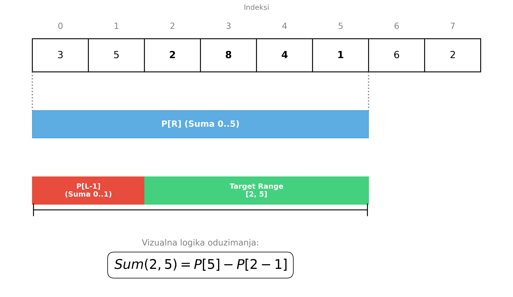
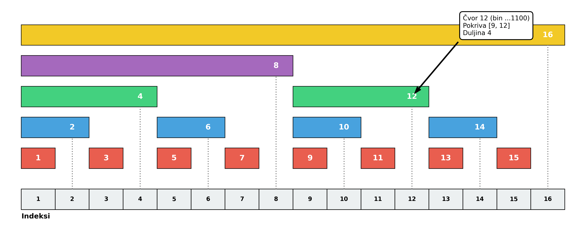
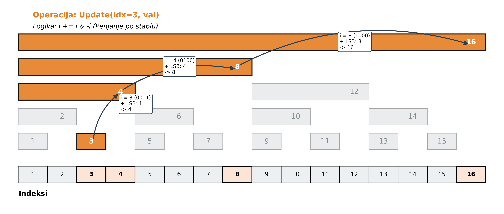
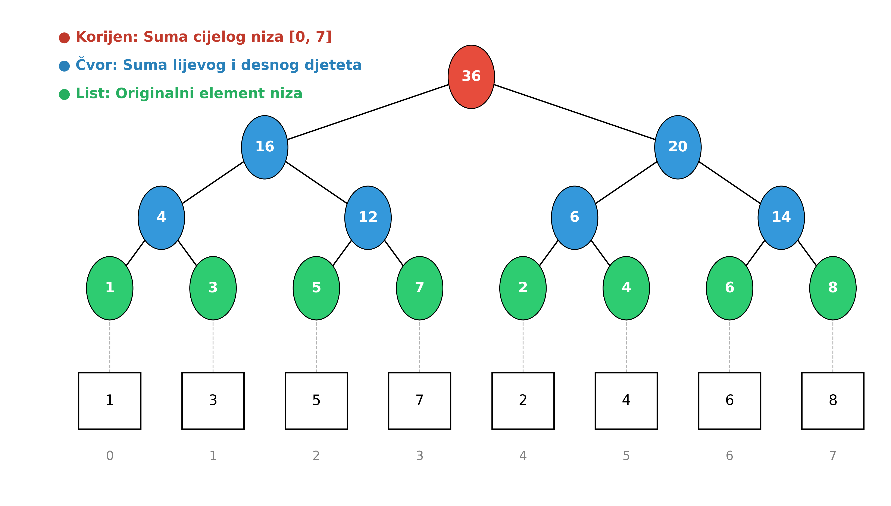
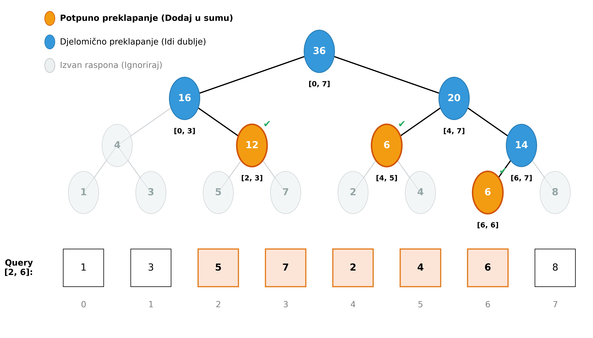
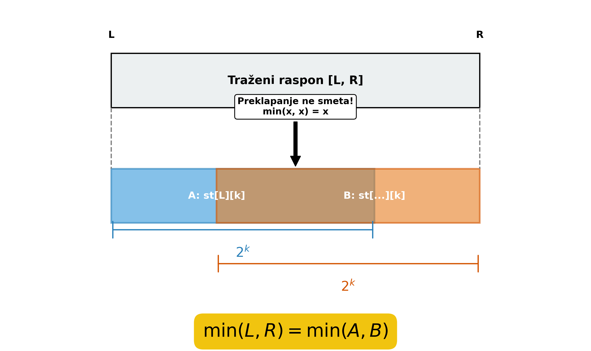

<!-- _class: title -->

# Upiti nad rasponima

## Prefiksne sume, Fenwick stablo i Segmentno stablo

---

# Sadržaj

1. **Uvod i Motivacija**

- Što su upiti nad rasponima?
- Zašto je naivni pristup prespor?

1. **Statički Upiti**

- Prefiksne sume

1. **Dinamički Upiti (Ažuriranje točke)**

- Fenwick stablo (Binary Indexed Tree)
- Segmentno stablo

1. **Zadaci za vježbu**

---

# Uvod: Što su upiti nad rasponima?

Imamo niz $A$. Želimo efikasno odgovarati na pitanja o podnizu (rasponu) $[L, R]$.

**Najčešći tipovi upita:**

1. **Sum:** Zbroj elemenata od $L$ do $R$.
2. **Min/Max:** Najmanji/najveći element u rasponu.
3. **najveći zajednički djelitelj (GCD), XOR, ..:** Ostale asocijativne operacije.

### Problem naivnog pristupa

Ako za svaki upit vrtimo petlju od $L$ do $R$:

- Složenost jednog upita: $O(N)$
- Za $Q$ upita: **$O(N \cdot Q)$**
- Za $N, Q = 10^5$, to je $10^{10}$ operacija $\to$ **Time Limit Exceeded (TLE)**.

Cilj: **$O(\log N)$** ili **$O(1)$** po upitu.

---

# Statički upiti: Prefiksne Sume (1/2)

Ako se niz **ne mijenja**, možemo koristiti prefiksne sume.

**Ideja:** `P[i]` sadrži zbroj prvih $i$ elemenata: $A[0] + \dots + A[i-1]$.

**Izgradnja $O(N)$:**

```cpp
vector<long long> P(n + 1, 0);
for (int i = 0; i < n; ++i) {
    P[i+1] = P[i] + array[i];
}
```

**Upit $O(1)$:** Zbroj raspona $[L, R]$ (inkluzivno, 0-indeksirano) je:
$$ \text{sum}(L, R) = P[R] - P[L-1] $$

---

# Statički upiti: Prefiksne Sume (2/2)



---

# Dinamički upiti: Motivacija

Što ako se vrijednosti u nizu **mijenjaju**?

- Prefiksne sume zahtijevaju ponovnu izgradnju: $O(N)$ po promjeni.
- Trebamo strukturu koja podržava i **Update** i **Query** brzo.

## Fenwick stablo (Binary Indexed Tree - BIT)

- Podržava **Point Update** i **Range Sum**.

- Složenost: **$O(\log N)$** za obje operacije.
- Memorija: **$O(N)$**.
- Jako malo koda, bazira se na bitovnim operacijama.

**Intuicija:** Svaki indeks $k$ pamti sumu određenog raspona definiranog najvećom potencijom broja 2 koja dijeli $k$ (LSB). LSB (Least Significant Bit) je najmanje značajni bit u binarnom zapisu broja — najdesniji bit koji je 1.

---

# Fenwick stablo



---

# Logika: Tko je za što odgovoran?

Ključ razumijevanja je u **binarnom zapisu** indeksa. Svaki čvor u nizu ne čuva samo svoju vrijednost, već sumu određenog bloka.

- Dužina bloka određena je **najmanjim bitom jedinice** (LSB - Least Significant Bit).
- **Pravilo:** Indeks pokriva raspon `[indeks - LSB + 1, indeks]`.

**Primjeri (1-based notacija):**

- `12` (`1100`) $\rightarrow$ LSB je 4. Pokriva 4 elementa: `[9, 10, 11, 12]`.
- `6` (`0110`) $\rightarrow$ LSB je 2. Pokriva 2 elementa: `[5, 6]`.
- `7` (`0111`) $\rightarrow$ LSB je 1. Pokriva 1 element: `[7]`.

---

# Fenwick stablo: ažuriranje vrijednosti



---

# Logika kretanja: Gore i dolje

Kako se krećemo po stablu ovisi o operaciji:

1. **Upit (Query/Read):** Krećemo se **DOLJE** (prema 0).
    - Uzimamo sumu trenutnog bloka.
    - Oduzimamo dužinu bloka da skočimo na kraj prethodnog raspona.
    - *Cilj:* Sakupiti sve dijelove prefiksa.

2. **Ažuriranje (Update):** Krećemo se **GORE** (prema N).
    - Ažuriramo trenutni čvor.
    - Dodajemo dužinu bloka da nađemo prvog "roditelja" koji nas sadrži.
    - *Cilj:* Obavijestiti sve veće blokove da se dio njih promijenio.

---

# Fenwick stablo: implementacija

Budući da u C++ najčešće koristimo indekse od 0, formule se blago prilagođavaju kako bi oponašale logiku LSB-a:

**1. Kretanje gore (Update):** `idx = idx | (idx + 1)`

- Ova operacija popunjava nizom jedinica skroz desno, efektivno skačući na sljedeći raspon koji "pokriva" trenutni indeks.
- Primjer: Ako smo na `0011` (3), operacija nas vodi na `0111` (7), pa `1111` (15)...

**2. Kretanje dolje (Query):** `r = (r & (r + 1)) - 1`

- Ovo je ekvivalent brisanja najmanjeg bita u 1-based sustavu, ali prilagođeno za 0-based.
- Efektivno "skida" zadnji blok raspona.

---

# Računanje sume raspona $[L, R]$

Fenwick stablo ne može izravno vratiti sumu od $L$ do $R$. Ono uvijek vraća **prefiks sumu** (od početka do nekog indeksa).

Koristimo princip oduzimanja prefiksa: $Suma(L, R) = Suma(0, R) - Suma(0, L-1)$

**Vizualno:**

1. Tražimo sumu plavog dijela (od $L$ do $R$)
2. Izračunamo sumu do $R$ (`query(R)`)
3. Oduzmemo sumu do $L-1$ (`query(L-1)`)
4. Ostatak je traženi raspon

*Vremenska složenost ostaje $O(\log N)$ jer radimo samo dva upita.*

---

# Primjer: Upit za raspon $[5, 13]$

Želimo izračunati sumu elemenata od indeksa 5 do 13, formula: `Rezultat = query(13) - query(4)`

**1. Korak: Izračun `query(13)` (Suma $[0, 13]$)**, algoritam kreće od 13 i skuplja blokove unazad (prema 0):

- Uzima **blok 13** (pokriva samo sebe). $\rightarrow$ *skače na 12*
- Uzima **blok 12** (pokriva $[9, 12]$). $\rightarrow$ *skače na 8*
- Uzima **blok 8** (pokriva $[1, 8]$). $\rightarrow$ *skače na 0 (kraj)*

> $\text{Suma}_A = \text{tree}[13] + \text{tree}[12] + \text{tree}[8]$

**2. Korak: Izračun `query(4)` (Suma $[0, 4]$)**, algoritam kreće od 4 (jer je to $L-1$) i skuplja unazad:

- Uzima **blok 4** (pokriva $[1, 4]$). $\rightarrow$ *skače na 0 (kraj)*

> $\text{Suma}_B = \text{tree}[4]$

**3. Korak: Oduzimanje**
`Rezultat` = $\text{Suma}_A - \text{Suma}_B$.
Efektivno smo od sume prvih 13 brojeva "odrezali" prva 4 broja. Ostaje točno suma od 5 do 13.

---

# Fenwick stablo: implementacija

Koristimo bitovne trikove za kretanje po stablu.
*(Implementacija za 0-based indeksiranje)*

```cpp
// Dodaje 'delta' na indeks 'idx'
void update(int idx, int delta) {
    for (; idx < n; idx = idx | (idx + 1))
        bit[idx] += delta;
}

// Vraća sumu prefiksa [0, r]
long long query(int r) {
    long long res = 0;
    for (; r >= 0; r = (r & (r + 1)) - 1)
        res += bit[r];
    return res;
}

// Suma raspona [l, r]
long long query(int l, int r) {
    return query(r) - query(l - 1);
}
```

---

# Segmentno stablo

Fleksibilnije od Fenwick stabla. Podržava:

- Sum, Min, Max, GCD, XOR...
- Čak i složenije operacije (npr. max subsegment sum).

**Struktura:**

- Binarno stablo izgrađeno nad nizom.
- **Listovi:** Elementi originalnog niza.
- **Unutarnji čvorovi:** Agregat (npr. zbroj) svoje djece.
- **Korijen:** Agregat cijelog niza $[0, N-1]$.

**Složenost:**

- Izgradnja: $O(N)$
- Upit i ažuriranje: $O(\log N)$

---

# Segmentno stablo: Vizualizacija



---

# Kako pamtimo stablo u nizu?

Iako je logička struktura stablo, fizički koristimo običan niz.
Koristimo **Heap-like indeksiranje**, slično kao kod binarne gomile (Binary heap):

Ako je čvor na indeksu `k`:

- Njegovo **lijevo dijete** je na `2 * k`
- Njegovo **desno dijete** je na `2 * k + 1`
- Korijen je na indeksu `1`.

> Zato alociramo niz veličine `4 * N`.
> *(Sigurna granica jer stablo nije uvijek savršeno popunjeno ako N nije potencija broja 2).*

---

# Segmentno stablo: Izgradnja (Build)

Rekurzivno dijelimo niz na polovice dok ne dođemo do listova. Zatim se vraćamo nazad (backtracking) i računamo sume.

```cpp
long long tree[4 * N]; // 4x veličina niza

// Poziv: build(1, 0, n-1)
void build(int node, int start, int end) {
    if (start == end) {
        // Došli smo do lista
        tree[node] = A[start];
    } else {
        int mid = (start + end) / 2;
        // Rekurzivno gradi djecu
        build(2*node, start, mid);
        build(2*node+1, mid+1, end);
        // Spoji rezultate (Pull up)
        tree[node] = tree[2*node] + tree[2*node+1]; 
    }
}
```

# Segmentno stablo: Ažuriranje (Update)

Slično binarnoj pretrazi. Tražimo list koji treba mijenjati, a pri povratku ažuriramo sve pretke.

```cpp
// Ažuriranje (Point Update)
void update(int node, int start, int end, int idx, int val) {
    if (start == end) {
        tree[node] = val;
    } else {
        int mid = (start + end) / 2;
        if (start <= idx && idx <= mid) 
            update(2*node, start, mid, idx, val); // Lijevo
        else 
            update(2*node+1, mid+1, end, idx, val); // Desno
        
        tree[node] = tree[2*node] + tree[2*node+1];
    }
}
```

---

# Logika upita: Tri slučaja

Kad tražimo sumu raspona $[L, R]$, svaki čvor u stablu provjerava svoj raspon $[start, end]$ u odnosu na traženi $[L, R]$.

Postoje samo 3 situacije:

1. 🔴 **Bez preklapanja:** Čvor je potpuno izvan $[L, R]$.
    - *Akcija:* Vrati `0` (ili neutralni element).
2. 🟢 **Potpuno preklapanje:** Čvor je cijeli unutar $[L, R]$.
    - *Akcija:* Vrati vrijednost čvora `tree[node]`. **Ne idi dublje!**
3. 🟡 **Djelomično preklapanje:** Dio čvora je unutra, dio vani.
    - *Akcija:* Podijeli se! Pozovi upit za lijevo i desno dijete.

---

# Segmentno stablo: Upit (Code)

Implementacija tri slučaja:

```cpp
long long query(int node, int start, int end, int l, int r) {
    // 1. Potpuno izvan (🔴)
    if (r < start || end < l) return 0;

    // 2. Potpuno unutar (🟢)
    if (l <= start && end <= r) return tree[node];

    // 3. Djelomično (🟡) -> pitaj djecu
    int mid = (start + end) / 2;
    long long p1 = query(2*node, start, mid, l, r);
    long long p2 = query(2*node+1, mid+1, end, l, r);
    
    return p1 + p2;
}
```

---

# Primjer izvršavanja upita

Niz: `[1, 2, 3, 4, 5, 6, 7, 8]` (indeksi 0-7).
Upit: **Suma od 2 do 6** (`[2, 6]`). Očekujemo $3+4+5+6+7 = 25$.

1. **Korijen [0, 7]:** Djelomično se preklapa s [2, 6]. $\rightarrow$ Zovi djecu.
    2.  **Lijevo [0, 3]:** Djelomično.
        3.  **LL [0, 1]:** Potpuno izvan [2, 6]. $\rightarrow$ Vrati `0`.
        4.  **LR [2, 3]:** Potpuno unutar [2, 6]. $\rightarrow$ Vrati `sum(2,3)` = **7**.
        *Lijeva suma = 0 + 7 = 7.*
    5.  **Desno [4, 7]:** Djelomično.
        6.  **RL [4, 5]:** Potpuno unutar [2, 6]. $\rightarrow$ Vrati `sum(4,5)` = **11**.
        7.  **RR [6, 7]:** Djelomično (jer trebamo samo 6).
            8.  **RRL [6, 6]:** Unutra. $\rightarrow$ Vrati **7**.
            9.  **RRR [7, 7]:** Vani. $\rightarrow$ Vrati `0`.
            *RR suma = 7.*
        *Desna suma = 11 + 7 = 18.*

**Konačni rezultat:** $7 + 18 = 25$.

---

# Segmentno stablo: Vizuralizacija



---

<!-- _class: title -->
# Zadaci za vježbu

---

<!-- _class: title -->

# CSES: Static Range Sum Queries

## Uvod u Prefiksne sume

---

# Zadatak: Static Range Sum Queries

**Problem:**
Zadan je niz od $N$ cijelih brojeva. Trebamo odgovoriti na $Q$ upita.
Svaki upit traži zbroj elemenata u rasponu $[a, b]$.

**Ulaz:**

- $N, Q$ ($1 \le N, Q \le 2 \cdot 10^5$)
- Niz vrijednosti $x_i$ ($1 \le x_i \le 10^9$)
- $Q$ linija s parovima $(a, b)$.

**Izlaz:**

- Zbroj elemenata za svaki upit.

---

# Zašto naivni pristup ne radi?

Naivno rješenje bi za svaki upit vrtjelo petlju od $a$ do $b$.

```cpp
// Naivno rješenje
for(int i = 0; i < q; ++i) {
    long long sum = 0;
    for (int j = a; j <= b; ++j) sum += x[j]; // O(N) u najgorem slučaju
    cout << sum << endl;
}
```

**Analiza složenosti:**

- Jedan upit: $O(N)$
- $Q$ upita: $O(N \cdot Q)$
- Uvrštavanje ograničenja: $(2 \cdot 10^5) \times (2 \cdot 10^5) = 4 \cdot 10^{10}$ operacija.
- Limit je 1 sekunda ($\approx 10^8$ operacija). Ovo je **presporo (TLE)**.

---

# Rješenje: Prefiksne sume

Budući da se niz **ne mijenja** (statičan je), možemo unaprijed izračunati zbrojeve.

Definiramo niz `P` (prefiksne sume) gdje je:
$$ P[i] = x[1] + x[2] + \dots + x[i] $$
*(Zbroj prvih $i$ elemenata)*.

**Rekurzivna formula:**
$$ P[i] = P[i-1] + x[i] $$
(Uzimamo zbroj svega prije i dodamo trenutni element).

---

# Intuicija: Oduzimanje raspona

Kako dobiti zbroj od $a$ do $b$ koristeći samo `P`?

Zbroj $[a, b]$ je zapravo:
(Zbroj svega od 1 do $b$) **MANJE** (Zbroj svega od 1 do $a-1$).

$$ \text{Sum}(a, b) = P[b] - P[a-1] $$

**Složenost:**

- **Izgradnja P:** $O(N)$ (jedan prolaz kroz niz).
- **Upit:** $O(1)$ (samo jedno oduzimanje).
- **Ukupno:** $O(N + Q)$. Ovo je vrlo brzo.

---

# Implementacija: Detalji

1. **Indeksiranje:** Zadatak koristi 1-bazirano indeksiranje ($1 \dots N$). Najlakše je alocirati niz veličine `N+1` i postaviti `P[0] = 0`. Tako formula `P[b] - P[a-1]` radi i kada je $a=1$.
2. **Tip podataka:** Maksimalni zbroj može biti $2 \cdot 10^5 \times 10^9 = 2 \cdot 10^{14}$. To ne stane u `int`. **Obavezno koristi `long long`**.

---

# Kod rješenja (C++)

```cpp
int main() {
    // Brži I/O
    ios_base::sync_with_stdio(false);
    cin.tie(NULL);

    int n, q;
    cin >> n >> q;

    // P[i] će čuvati sumu x[1]...x[i]
    // P[0] je inicijalno 0
    vector<long long> P(n + 1, 0);

    for (int i = 1; i <= n; i++) {
        int x;
        cin >> x;
        P[i] = P[i-1] + x; // Trenutni prefiks = Prethodni prefiks + trenutna vrijednost
    }

    while (q--) {
        int a, b;
        cin >> a >> b;
        cout << P[b] - P[a-1] << "\n"; // Formula za sumu raspona
    }

    return 0;
}
```

---

# Osvrt: Static Range Sum Queries

## Ključne lekcije

1. **Long Long:** Zbroj niza od $2 \cdot 10^5$ elemenata veličine $10^9$ može biti $2 \cdot 10^{14}$. To ne stane u `int`.
2. **1-based indeksiranje:** Iako C++ koristi 0-based, u prefiksnim sumama je često lakše koristiti 1-based (`P[0]=0`) kako bi formula `P[R] - P[L-1]` radila i za $L=1$ bez dodatnih `if` uvjeta.
3. **Ograničenje:** Ova metoda radi isključivo za **statične** nizove. Ako se dogodi *update*, moramo ponovno računati cijeli niz $P$ u $O(N)$.

---

<!-- _class: title -->

# CSES: Static Range Minimum Queries

## Uvod u Sparse Table

---

# Zadatak: Static Range Minimum Queries

**Problem:**
Zadan je niz od $N$ cijelih brojeva. Trebamo odgovoriti na $Q$ upita.
Svaki upit traži **minimalnu vrijednost** u rasponu $[a, b]$.

**Ograničenja:**

- $N, Q \le 2 \cdot 10^5$.
- Niz je statičan (nema `update` operacija).

**Zašto ne prefiksne sume?**
Kod zbrajanja vrijedi `sum(a, b) = P[b] - P[a-1]`.
Kod minimuma **ne postoji inverzna operacija**. Ne možemo "oduzeti" minimum.
$$ \min(a, b) \neq \text{prefMin}[b] - \text{prefMin}[a-1] $$

---

# Rješenje: Sparse Table

Za statičke upite nad operacijama kao što su `min`, `max`, `gcd` (tzv. idempotentne operacije), **Sparse Table** je najmoćnija struktura.

**Performanse:**

- **Izgradnja:** $O(N \log N)$
- **Upit:** $O(1)$ (Konstantno vrijeme!)

**Ideja:**
Unaprijed izračunamo minimum za sve raspone čija je duljina **potencija broja 2**.
`st[i][j]` = minimum raspona koji počinje na indeksu `i` i ima duljinu $2^j$.

Raspon pokriven s `st[i][j]` je $[i, i + 2^j - 1]$.

---

# Izgradnja tablice (Precomputation)

Koristimo dinamičko programiranje.
Raspon duljine $2^j$ možemo podijeliti na dva raspona duljine $2^{j-1}$.

**Rekurzivna veza:**
Minimum raspona duljine $2^j$ je manji od minimuma:

1. Prve polovice (duljina $2^{j-1}$ počinje na $i$)
2. Druge polovice (duljina $2^{j-1}$ počinje na $i + 2^{j-1}$)

$$ st[i][j] = \min(st[i][j-1], \quad st[i + 2^{j-1}][j-1]) $$

---

# Implementacija izgradnje

```cpp
const int MAXN = 200005;
const int K = 25; // Dovoljno jer 2^25 > 2*10^5
int st[MAXN][K];  // Sparse Table
int log_table[MAXN]; // Za brzo računanje logaritma

// 1. Inicijalizacija (base case: duljina 2^0 = 1)
for (int i = 0; i < n; i++)
    st[i][0] = array[i];

// 2. DP gradnja
for (int j = 1; j < K; j++) { // Za svaku potenciju j
    for (int i = 0; i + (1 << j) <= n; i++) {
        // Kombiniraj dvije polovice
        st[i][j] = min(st[i][j-1], st[i + (1 << (j-1))][j-1]);
    }
}
```

---

# Kako odgovoriti na upit u $O(1)$? (1/2)

Želimo minimum u $[L, R]$. Duljina raspona je $len = R - L + 1$.
Nađemo najveću potenciju $k$ takvu da $2^k \le len$.

Možemo pokriti cijeli raspon $[L, R]$ s **dva preklapajuća** raspona duljine $2^k$:

1. Prvi počinje na $L$: pokriva $[L, L + 2^k - 1]$
2. Drugi završava na $R$: pokriva $[R - 2^k + 1, R]$

Budući da je $\min(A, B) = \min(A, B, B)$ (preklapanje ne smeta), rješenje je:

$$ \min(st[L][k], \quad st[R - 2^k + 1][k]) $$

---

# Kako odgovoriti na upit u $O(1)$? (2/2)



---

# Implementacija: Priprema konstanti

```cpp
#include <iostream>
#include <vector>
#include <algorithm>
#include <cmath>
using namespace std;

    
const int MAXN = 200005; // Maksimalni N (obično 2e5 + 5 (da smo sigurni))
const int K = 20; // Broj razina: 2^20 > 200,000 (dovoljno je i 18)

int st[MAXN][K]; // Glavna tablica
int logs[MAXN]; // Tablica za brzi logaritam
  
```

---

# Implementacija: glavni dio

```cpp
int main() {
    int n, q; cin >> n >> q;
    // Učitaj i postavi nultu razinu (duljina 1)
    for (int i = 0; i < n; i++) cin >> st[i][0];

    // Precompute logs: logs[i] = floor(log2(i))
    logs[1] = 0;
    for (int i = 2; i <= n; i++) logs[i] = logs[i/2] + 1;

    // Izgradi Sparse Table
    for (int j = 1; j < K; j++)
        for (int i = 0; i + (1 << j) <= n; i++)
            st[i][j] = min(st[i][j-1], st[i + (1 << (j-1))][j-1]);

    while (q--) {
        int L, R; cin >> L >> R;
        L--; R--; // Prilagodba na 0-based indeksiranje
        int j = logs[R - L + 1];
        // O(1) upit preklapanjem
        cout << min(st[L][j], st[R - (1 << j) + 1][j]) << "\n";
    }
}
```

---

# Alternativa: Segmentno stablo

Ovaj zadatak se može riješiti i **Segmentnim stablom**.

- **Složenost:** $O(N)$ izgradnja, $O(\log N)$ upit.
- **Prednost:** Radi i ako se niz mijenja (Dynamic updates).
- **Nedostatak:** Sporije od Sparse Table za statičke podatke (zbog rekurzije i $\log N$ faktora).

Za potrebe ovog zadatka ($10^5$ upita), Sparse Table je elegantnije rješenje, ali Segmentno stablo bi također prošlo unutar limita.

---

<!-- _class: title -->

# CSES: Dynamic Range Sum Queries

## Fenwickovo Stablo (Binary Indexed Tree)

---

# Zadatak: Dynamic Range Sum Queries

**Problem:**

Zadan je niz od $N$ cijelih brojeva. Trebamo obraditi $Q$ upita dva tipa:

1. **Update:** Promijeni vrijednost na poziciji $k$ u vrijednost $u$.
2. **Sum:** Izračunaj zbroj u rasponu $[a, b]$.

**Ograničenja:**

- $N, Q \le 2 \cdot 10^5$.
- Vremenski limit: 1.00 s.

**Ključna razlika od prošlog zadatka:**

Vrijednosti se **mijenjaju**.

- Prefiksne sume bi trebale $O(N)$ za svaki update $\to$ Presporo ($O(NQ)$).
- Običan niz bi trebao $O(N)$ za svaki zbroj $\to$ Presporo.

---

# Rješenje: Fenwickovo Stablo (BIT)

Trebamo strukturu koja radi obje operacije (Update i Query) u **$O(\log N)$**.
Fenwickovo stablo je savršen kandidat za probleme sume.

**Ideja:**
Pamtimo parcijalne sume na indeksima definiranim binarnim zapisom broja.
Svaki indeks `i` pokriva raspon duljine $2^k$, gdje je $k$ broj nula na kraju binarnog zapisa od `i`.

**Operacije:**

- **Update:** Dodaj vrijednost na indeks `i` i sve njegove "roditelje" u BIT-u.
- **Query(i):** Zbroji vrijednosti penjući se po stablu (oduzimajući LSB).

---

# Implementacija BIT-a (1-based indexing)

Fenwick stablo prirodno radi s indeksima od 1 do $N$, što odgovara ulazu zadatka.

Ključna operacija: `i & -i` (dohvaća Least Significant Bit).

```cpp
vector<long long> bit;
int n;

// Dodaje 'delta' na indeks 'idx' (i utječe na sve relevantne nad-segmente)
void update(int idx, int delta) {
    for (; idx <= n; idx += idx & -idx)
        bit[idx] += delta;
}

// Vraća zbroj prefiksa [1, idx]
long long query(int idx) {
    long long sum = 0;
    for (; idx > 0; idx -= idx & -idx)
        sum += bit[idx];
    return sum;
}
```

---

# Zamka: "Set" vs "Add"

Zadatak traži: "Postavi vrijednost na indeksu $k$ na $u$" (**Assignment**).
BIT podržava: "Dodaj $x$ na indeks $k$" (**Increment**).

Kako to pomiriti?

1. Moramo pamtiti trenutno stanje niza u običnom polju `arr`.
2. Izračunamo razliku: `diff = nova_vrijednost - stara_vrijednost`.
3. Ažuriramo BIT s tom razlikom.
4. Ažuriramo `arr`.

```cpp
// Update query: k, u
long long diff = u - arr[k];
update(k, diff);
arr[k] = u; 
```

---

# Upit za raspon $[a, b]$

BIT funkcija `query(i)` vraća sumu prefiksa $[1, i]$.
Zbroj raspona $[a, b]$ dobivamo isto kao kod prefiksnih suma:

$$ \text{Sum}(a, b) = \text{query}(b) - \text{query}(a - 1) $$

---

# Potpuni kod rješenja: Inicijalizacija

```cpp
#include <iostream>
#include <vector>
using namespace std;

int n;
vector<long long> bit;
vector<int> arr; // Pamtimo originalne vrijednosti

void update(int idx, int val) {
    for (; idx <= n; idx += idx & -idx) bit[idx] += val;
}

long long query(int idx) {
    long long sum = 0;
    for (; idx > 0; idx -= idx & -idx) sum += bit[idx];
    return sum;
}
```

---

# Potpuni kod rješenja

```cpp
int main() {
    int q; cin >> n >> q;
    bit.resize(n + 1, 0);
    arr.resize(n + 1);

    // Inicijalna izgradnja
    for (int i = 1; i <= n; i++) {
        cin >> arr[i];
        update(i, arr[i]);
    }

    while (q--) {
        int type; cin >> type;
        if (type == 1) { // Update
            int k, u; cin >> k >> u;
            update(k, u - arr[k]); // Dodaj razliku
            arr[k] = u;            // Ažuriraj lokalno polje
        } else { // Query
            int a, b; cin >> a >> b;
            cout << query(b) - query(a - 1) << "\n";
        }
    }
}
```

---

# Alternativa: Segmentno Stablo

Ovaj zadatak se može riješiti i **Segmentnim stablom**.

- **Prednosti:** Intuitivnije za "Set value" operaciju (ne treba računati razliku), lakše se proširuje na složenije upite (min/max).
- **Mane:** Više koda, veća memorijska potrošnja ($4N$ vs $N$), malo sporija konstanta.

Za sumu s ažuriranjem točke, **Fenwick stablo** je obično preferirani izbor u natjecateljskom programiranju zbog brzine pisanja.

---

<!-- _class: title -->

# CSES: Dynamic Range Minimum Queries

---

# Zadatak: Dynamic Range Minimum Queries

**Problem:**
Zadan je niz od $N$ cijelih brojeva. Trebamo obraditi $Q$ upita dva tipa:

1. **Update:** Promijeni vrijednost na poziciji $k$ u vrijednost $u$.
2. **Minimum:** Pronađi minimalnu vrijednost u rasponu $[a, b]$.

**Ograničenja:**

- $N, Q \le 2 \cdot 10^5$.
- Vremenski limit: 1.00 s.

**Zašto ne prethodne metode?**

- **Prefiksne sume/BIT:** Operacija `min` nema inverz (ne možemo "oduzeti" minimum).
- **Sparse Table:** Ne podržava efikasno ažuriranje vrijednosti (zahtijeva ponovnu izgradnju).

Rješenje: **Segmentno Stablo**.

---

# Segmentno stablo: Struktura

Segmentno stablo je binarno stablo izgrađeno nad nizom.

- **Listovi:** Sadrže elemente originalnog niza.
- **Unutarnji čvorovi:** Sadrže minimum svoje djece.
    `tree[v] = min(tree[2*v], tree[2*v+1])`

**Svojstva:**

- Visina stabla je $O(\log N)$.
- Svaki raspon $[a, b]$ može se dekomponirati na $O(\log N)$ čvorova stabla.
- Promjena elementa utječe samo na put od lista do korijena ($O(\log N)$ čvorova).

---

# Implementacija: Izgradnja (Build)

Koristimo polje `tree` veličine $4N$.
Funkcija `build` rekurzivno gradi stablo.

```cpp
const int INF = 1e9 + 7;
vector<int> tree;
vector<int> arr;

// v = indeks čvora u stablu, tl/tr = granice raspona koji čvor pokriva
void build(int v, int tl, int tr) {
    if (tl == tr) {
        tree[v] = arr[tl]; // List
    } else {
        int tm = (tl + tr) / 2;
        build(2*v, tl, tm);       // Lijevo dijete
        build(2*v+1, tm+1, tr);   // Desno dijete
        // Operacija spajanja: MINIMUM
        tree[v] = min(tree[2*v], tree[2*v+1]); 
    }
}
```

---

# Implementacija: Ažuriranje (Update)

Promjena vrijednosti na poziciji `pos` u `new_val`.
Tražimo put do lista koji pokriva `pos`, ažuriramo ga, i pri povratku iz rekurzije ažuriramo roditelje.

```cpp
void update(int v, int tl, int tr, int pos, int new_val) {
    if (tl == tr) {
        tree[v] = new_val; // Ažuriraj list
    } else {
        int tm = (tl + tr) / 2;
        if (pos <= tm)
            update(2*v, tl, tm, pos, new_val);
        else
            update(2*v+1, tm+1, tr, pos, new_val);
            
        // Rekalkuliraj vrijednost roditelja
        tree[v] = min(tree[2*v], tree[2*v+1]);
    }
}
```

---

# Implementacija: Upit (Query)

Tražimo minimum u rasponu $[l, r]$.
Postoje 3 slučaja za trenutni čvor $[tl, tr]$:

1. Potpuno izvan traženog raspona: Vrati neutralni element (`INF`).
2. Potpuno unutar traženog raspona: Vrati vrijednost čvora.
3. Djelomično preklapanje: Pozovi rekurzivno za djecu i uzmi `min`.

```cpp
int query(int v, int tl, int tr, int l, int r) {
    if (l > r) 
        return INF; // Neutralni element za min
    if (l == tl && r == tr) 
        return tree[v]; // Potpuno preklapanje
        
    int tm = (tl + tr) / 2;
    return min(
        query(2*v, tl, tm, l, min(r, tm)),
        query(2*v+1, tm+1, tr, max(l, tm+1), r)
    );
}
```

---

# Glavni program

Paziti na indeksiranje! CSES koristi 1-based, naša implementacija SegTree-a je najlakša ako interno koristi 1-based (za `tl, tr`).

```cpp
int main() {
    int n, q;
    cin >> n >> q;
    arr.resize(n + 1);
    tree.resize(4 * n + 1);
    for (int i = 1; i <= n; i++) cin >> arr[i];
    build(1, 1, n); // Korijen je 1, pokriva [1, n]
    while (q--) {
        int type;
        cin >> type;
        if (type == 1) {
            int k, u; cin >> k >> u;
            update(1, 1, n, k, u);
        } else {
            int a, b; cin >> a >> b;
            cout << query(1, 1, n, a, b) << "\n";
        }
    }
}
```

---

# Sažetak složenosti

Za niz veličine $N$ i $Q$ upita:

- **Build:** $O(N)$ (posjećujemo svaki čvor jednom).
- **Update:** $O(\log N)$ (visina stabla).
- **Query:** $O(\log N)$ (u najgorem slučaju posjećujemo 4 čvora po razini).

Segmentno stablo je **univerzalan alat**.
Promjenom jedne linije koda (`min` u `+`, `max`, `gcd`, `xor`) rješavamo potpuno druge probleme.

---

<!-- _class: title -->

# CSES: Range Xor Queries

## Prefiksne sume s XOR operacijom

---

# Zadatak: Range Xor Queries

**Problem:**
Zadan je niz od $N$ cijelih brojeva. Trebamo odgovoriti na $Q$ upita.
Svaki upit traži **XOR sumu** vrijednosti u rasponu $[a, b]$.
$$ x_a \oplus x_{a+1} \oplus \dots \oplus x_b $$

**Ograničenja:**

- $N, Q \le 2 \cdot 10^5$.
- Niz je statičan (nema izmjena).

**Pitanje:**
Možemo li koristiti Segmentno stablo?
Da, ali to je $O(Q \log N)$. Budući da je niz statičan, možemo li brže?

---

# Svojstvo XOR operacije

Prisjetimo se ključnih svojstava XOR-a ($\oplus$):

1. **Komutativnost i asocijativnost:** Redoslijed nije bitan.
2. **Inverz:** Broj XOR-an sam sa sobom daje 0.
    $$ A \oplus A = 0 $$
3. **Neutralni element:** $A \oplus 0 = A$.

**Zaključak:**
XOR se ponaša slično kao zbrajanje/oduzimanje.
Ako imamo $A \oplus B = C$, onda je $C \oplus B = A$.
Možemo "poništiti" utjecaj nekog broja ponovnim XOR-anjem.

---

# Rješenje: Prefiksni XOR

Definiramo niz `P` (prefiksni XOR):
`P[i]` = $x_1 \oplus x_2 \oplus \dots \oplus x_i$

Kako dobiti XOR sumu raspona $[a, b]$?

$$ \text{XorSum}(a, b) = P[b] \oplus P[a-1] $$

**Zašto ovo radi?**
$$ P[b] = (x_1 \oplus \dots \oplus x_{a-1}) \oplus (x_a \oplus \dots \oplus x_b) $$
$$ P[a-1] = (x_1 \oplus \dots \oplus x_{a-1}) $$

Kada napravimo $P[b] \oplus P[a-1]$, dio $(x_1 \dots x_{a-1})$ se pojavljuje dvaput i poništava se (postaje 0), ostavljajući samo željeni raspon $(x_a \dots x_b)$.

---

# Implementacija

```cpp
int main() {
    ios_base::sync_with_stdio(false);
    cin.tie(NULL);

    int n, q;
    cin >> n >> q;
    vector<int> P(n + 1, 0); // P[i] sadrži xor sumu x[1]...x[i]

    for (int i = 1; i <= n; i++) {
        int x; cin >> x;
        P[i] = P[i-1] ^ x; // P[i] = P[i-1] ^ x
    }

    while (q--) {
        int a, b;
        cin >> a >> b;
        cout << (P[b] ^ P[a-1]) << "\n"; // O(1) upit
    }
    return 0;
}
```

---

# Što ako bi niz bio dinamičan?

Ako bi zadatak imao **Update** operacije ("promijeni vrijednost na indeksu $k$"), prefiksni niz više ne bi bio efikasan ($O(N)$ update).

U tom slučaju koristili bismo **Fenwickovo stablo** ili **Segmentno stablo**.

Jedina promjena u odnosu na "Range Sum Queries":

- Umjesto `+` koristimo `^` (XOR).
- Kod Fenwick stabla, `update` operacija je: `add(k, val ^ current_val)`.

Segmentno stablo za XOR:

```cpp
tree[v] = tree[2*v] ^ tree[2*v+1]; // Merge funkcija u segmentnom stablu
```

---

# Zadatak: Hotel Queries

## Pretraživanje po Segmentnom stablu (Tree Descent)

**Problem:**
Imamo $N$ hotela. Za svaki hotel znamo broj slobodnih soba ($h_i$).
Dolazi $M$ grupa turista. Svaka grupa traži $r_j$ soba.
Pravilo dodjele: Grupa ide u **prvi** (najljeviji) hotel koji ima **dovoljno** soba ($h_i \ge r_j$).
Nakon dodjele, broj soba u tom hotelu se smanjuje.

**Ulaz:**

- $N, M \le 2 \cdot 10^5$.
- Kapaciteti do $10^9$.

**Izlaz:**

- Za svaku grupu ispiši indeks hotela (ili 0 ako nema mjesta).

---

# Zašto naivni pristup ne radi?

Za svaku grupu bismo morali prolaziti kroz hotele od 1 do $N$ dok ne nađemo prvi slobodan.

```cpp
// Naivno rješenje
for (int i = 0; i < m; ++i) { // Za svaku grupu
    int assigned = 0;
    for (int j = 1; j <= n; ++j) { // Prođi hotele
        if (hotels[j] >= required) {
            hotels[j] -= required;
            assigned = j;
            break;
        }
    }
    cout << assigned << " ";
}
```

**Složenost:** $O(N \cdot M)$. Za $N, M = 2 \cdot 10^5$, to je $4 \cdot 10^{10}$ operacija $\to$ **TLE**.
Trebamo rješenje brže od linearnog pretraživanja, idealno **$O(\log N)$** po grupi.

---

# Intuicija: Max Segment Tree (1/2)

Kako brzo naći prvi broj $\ge X$?
Ako u čvoru segmentnog stabla pamtimo **MAKSIMUM** raspona, možemo donositi odluke:

`tree[v]` = Maksimalni broj slobodnih soba u rasponu koji čvor `v` pokriva.

**Logika spuštanja (Tree Walk):**
Stojimo u čvoru. Trebamo hotel s barem $r$ soba.

1. Ako je `tree[v] < r`, u ovom rasponu uopće nema dovoljno velikog hotela. (Vrati 0).
2. Inače, rješenje sigurno postoji. Gdje je *prvi* takav?
   -Pogledaj **lijevo dijete**: Ako `tree[2*v] >= r`, rješenje je lijevo! (Prioritet lijevom jer tražimo prvi indeks).
   -Inače, rješenje mora biti **desno** (jer znamo da postoji u trenutnom čvoru, a nije lijevo).

---

# Intuicija: Max Segment Tree (2/2)


---

# Glavni program: Hotel Queries (1/2)

Logika za svaku grupu:

1. Pronađi indeks hotela pomoću `query`.
2. Ako postoji, ispiši ga.
3. Smanji kapacitet tog hotela (lokalno u nizu).
4. Ažuriraj Segmentno stablo s novim kapacitetom.

---

# Analiza složenosti

- **Izgradnja:** $O(N)$.
- **Upit (Query):** Spuštamo se od korijena do lista. U svakom koraku radimo jednu usporedbu i idemo lijevo ili desno. Visina stabla je $\log N$. $\to O(\log N)$.
- **Ažuriranje (Update):** Standardno $O(\log N)$.
- **Ukupno:** $O(M \log N)$.

Za $N, M = 2 \cdot 10^5$, $\log N \approx 18$.
Ukupno operacija $\approx 3.6 \cdot 10^6$, što je znatno ispod limita od $10^8$.

---

# Sažetak: Segment Tree Walk

Ovo je moćna tehnika. Umjesto binarnog pretraživanja *nad rješenjem* ($O(\log^2 N)$), koristimo strukturu stabla za binarno pretraživanje ($O(\log N)$).

Ključni uvjeti:

1. Čvor mora sadržavati dovoljno informacija da odlučimo "Lijevo" ili "Desno" (ovdje: Max).
2. Problem mora tražiti "prvi" ili "k-ti" element s nekim svojstvom.

---
<!-- _class: title -->

# Zaključak

## Pregled današnjih vježbi

---

# Koju strukturu odabrati?

| Struktura | Update | Query | Složenost | Memorija | Koristi kad... |
| :--- | :--- | :--- | :--- | :--- | :--- |
| **Prefiksne sume** | Sporo $O(N)$ | $O(1)$ | $O(N)$ | $O(N)$ | Niz je statičan, traži se suma/xor. |
| **Sparse Table** | Nemoguće | $O(1)$ | $O(N \log N)$ | $O(N \log N)$ | Statičan niz, traži se Min/Max/GCD. |
| **Fenwick (BIT)** | $O(\log N)$ | $O(\log N)$ | $O(N)$ | $O(N)$ | Dinamičan niz, traži se prefiksna suma. Malo koda. |
| **Segmentno stablo** | $O(\log N)$ | $O(\log N)$ | $O(N)$ | $O(4N)$ | Dinamičan niz, složeni upiti (Min/Max na rasponu). |
