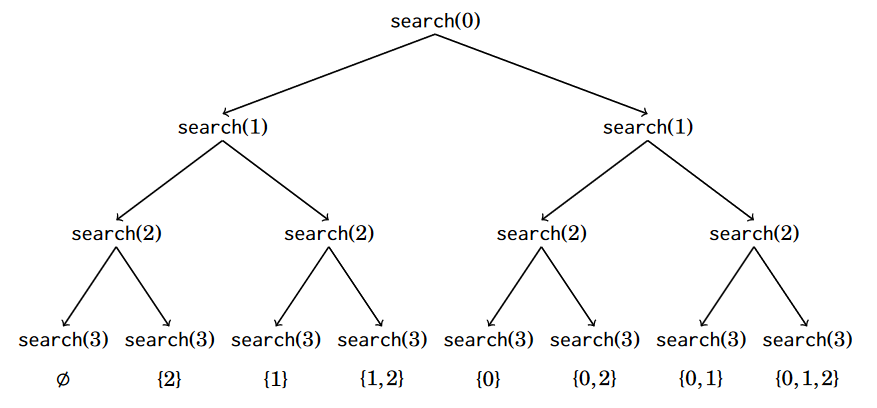
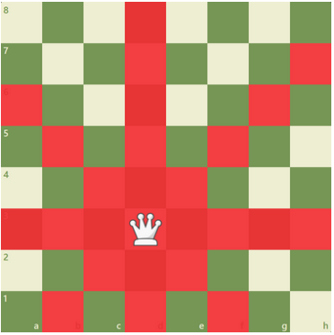

# [Potpuna pretraga](https://cses.fi/book/book.pdf#chapter.5)

Potpuna pretraga (*eng. Complete search*) opća je metoda koja se može koristiti za rješavanje gotovo svakog algoritamskog problema. Ideja je generirati sva moguća rješenja problema korištenjem grube sile (*eng. brute force*), a zatim odabrati najbolje rješenje ili prebrojati rješenja, ovisno o problemu.
Potpuna pretraga dobra je tehnika ako ima dovoljno vremena za prolazak kroz sva rješenja, jer je pretragu obično lako provesti i uvijek daje rješenje. Ako je potpuna pretraga prespora, možda će biti potrebne druge tehnike, poput pohlepnih algoritama ili dinamičkog programiranja.

## Zadatak 1: Generiranje podskupova

Zadan je skup $\{0, 1, 2, ..., n\}$, s pomoću rekurzije generirajte sve podskupove od zadanoga skupa.
Prilikom ispisa ne treba voditi računa o redoslijedu ispisa podskupova.



**Primjer**

**Input:**

```text
0 1 2
```

**Output:**

```text
[]
[2]
[1]
[1, 2]
[0]
[0, 2]
[0, 1]
[0, 1, 2]
```

{: .highlight }
`[]` označava prazan skup $\emptyset$.

## Zadatak 2: K-sum

Provjerite ako u zadanoj listi $l$ postoji podlista ${a_1, ..., a_n}$ takva da je njena suma $k$?

**Input:**
U prvoj liniji unosi se tražena suma $k$, u drugoj broj elemenata u listi $n$,
a u tre'oj lista cijelih brojeva $l$.

**Output:**
Ispis brojeva čija suma iznosi $k$.

**Primjer**

**Input:**

```text
6
3
1 2 4
```

**Output:**

```text
2 4
```

## Zadatak 3: K-sum Meet in the middle

S pomoću metode Meet in the middle provjerite ako u zadanoj listi $l$ postoji skup ${a_1, ..., a_n}$ takva da je njena suma $k$?

Razmotrimo problem gdje nam je dana lista $l$ koja sadržava $n$ brojeva i broj $k$, te želimo saznati ako je moguće odabrati brojeve s liste $l$ tako da njihov zbroj bude $k$.

**Input:**
U prvoj liniji unosi se tražena suma $k$, a u drugoj lista cijelih brojeva $l$.

**Output:**
Ispis "YES" ako je moguće generirati sumu, u protivnom se ispisuje -1.

**Input:**

```text
15
2,4,5,9
```

**Output:**

```text
YES
```

**Input:**

```text
15
7,11,5,9
```

**Output:**

```text
-1
```

## Zadatak 4: Stvaranje stringova

Za zadani string $s$, zadatak je generirati sve različite stringove koji se mogu stvoriti s pomoću znakova iz zadanog stringa $s$.

**Input:**
Ulazni string duljine $n$ ($1 \le n \le 7$), koji se sastoji od slova od a do z.

**Output:**
Prvo ispišite cijeli broj $k$: ukupan broj stringova. Zatim u $k$ redaka ispišite stvorene stringove.

### Primjer

**Input:**

```text
aabac
```

**Output:**

```text
20
aaabc
aaacb
aabac
aabca
aacab
aacba
abaac
abaca
abcaa
acaab
acaba
acbaa
baaac
baaca
bacaa
bcaaa
caaab
caaba
cabaa
cbaaa
```

## Zadatak 5: Postavljanje N-kraljica

Napišite program koji traži od korisnika da unese broj `n`, što predstavlja veličinu šahovske ploče (n x n). Program treba izračunati i ispisati broj mogućnosti za postavljanje `n` kraljica na šahovskoj ploči tako da nijedna kraljica ne napada drugu. Kraljica može napasti u svim smjerovima: horizontalno, vertikalno i dijagonalno.



**Ulaz**
- Jedan cijeli broj `n` (1 ≤ n ≤ 15), koji predstavlja veličinu šahovske ploče.

**Izlaz**

- Jedan cijeli broj, koji predstavlja broj mogućnosti za postavljanje `n` kraljica na šahovskoj ploči.

### Primjer 1

**Ulaz:**

```text
4
```

**Izlaz:**

```text
2
```

### Primjer 2

**Ulaz:**

```text
5
```

**Izlaz:**

```text
10
```

## Zadaci za vježbu

- [Chessboard and Queens](https://cses.fi/problemset/task/1624)
- [Grid Paths](https://cses.fi/problemset/task/1625)
- [Sail](https://codeforces.com/problemset/problem/298/B)

[Sljedeća lekcija: Pohlepni algoritmi](../pohlepni-algoritmi){: .btn .btn-purple .float-right}
